<!-- ====================================================================
     HERO: Monochrome Typing ASCII Portrait + 3D Rocking Wordmark
     ==================================================================== -->

<h3><code>hxrshityadav@github ~ $ whoami</code></h3>

<table>
  <tr>
    <td valign="top">
      
    </td>
    <td valign="top">
      
    </td>
  </tr>
</table>

 

  <b>Fullstack Developer · AI Builder · Open Source Enthusiast</b> 
  Building high-impact web products, intelligent AI apps, and developer tools.

 
 

<!-- ====================================================================
     TERMINAL NEOFETCH / SYSTEM INFO
     ==================================================================== -->

<h3><code>hxrshityadav@github ~ $ neofetch --me</code></h3>

 
 

<!-- ====================================================================
     TECH STACK & SKILLS
     ==================================================================== -->

<h3><code>hxrshityadav@github ~ $ cat skills.json</code></h3>

  

 
 

<!-- ====================================================================
     LIVE ANIMATED CONTRIBUTION HEATMAP
     ==================================================================== -->

<h3><code>hxrshityadav@github ~ $ ./contributions.sh</code></h3>

 
 

<!-- ====================================================================
     GITHUB STATS & STREAKS (DARK THEME)
     ==================================================================== -->

<h3><code>hxrshityadav@github ~ $ ./stats.sh</code></h3>

  
  &nbsp;&nbsp;
  

  

 
 

<!-- ====================================================================
     CONNECT & SOCIAL LINKS
     ==================================================================== -->

<h3><code>hxrshityadav@github ~ $ ./connect.sh</code></h3>

  
  &nbsp;
  
  &nbsp;
  
  &nbsp;
  

 

