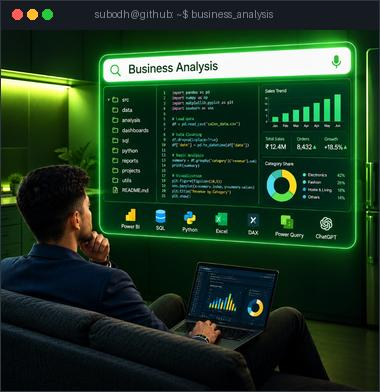
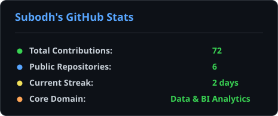
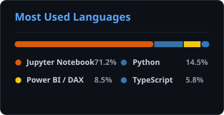

<!-- ====================================================================
     HERO: Futuristic Green Analysis Visual + 3D Rocking Wordmark
     ==================================================================== -->

<table>
  <tr>
    <td valign="top">
      
    </td>
    <td valign="top">
      
    </td>
  </tr>
</table>

 

# 👋 Hi, I'm Subodh Kumar
### 📊 Data Analyst | Business Intelligence | Power BI

**Turning raw data into meaningful insights and smarter business decisions.**

I work with data to uncover patterns, track business performance, and build interactive dashboards that make complex information easier to understand.

  
  &nbsp;
  
  &nbsp;
  

 

---

## 🧑‍💻 About Me

* 🎯 **Aspiring Data Analyst / BI Analyst**, focused on analytics and business intelligence.
* 🏅 **Microsoft Certified: Power BI Data Analyst Associate (PL-300)**.
* 📊 **Experienced in building interactive Power BI dashboards** and working with business data.
* 🛠️ **Skilled in SQL, Python, Excel, Power BI, DAX, and Power Query**.
* 🧹 Interested in **data cleaning, exploratory data analysis (EDA), KPI reporting**, and data visualization.
* 🌱 Continuously improving my analytical, technical, and business problem-solving skills.
* 🤝 **Open to connecting with analytics professionals** and exploring Data Analyst / BI opportunities.

 

---

## 🛠️ Tech Stack

### 📊 Business Intelligence & Visualization

  
  
  
  

### 💻 Programming & Databases

  
  
  
  

### 📈 Data Analysis & Tools

  
  
  
  
  

 

---

## 🚀 Featured Projects

<table width="100%">
  <tr>
    <td width="50%" valign="top">
      <h3 align="center">📱 <a href="https://github.com/subodhdataworks/PhonePe-Payment-Analytics-PowerBI">PhonePe Payment Analytics</a></h3>
      

        
      

      <b>Digital Payment Business Intelligence Case Study</b> analyzing transaction performance, user demographics, and payment reliability across ₹3.47B+ GMV.
        
      <b>Key Highlights:</b>
      <ul>
        <li>📊 <b>300K+</b> Transactions analyzed</li>
        <li>💰 <b>₹3.47B</b> Total transaction value</li>
        <li>👥 <b>108K</b> Unique active users</li>
        <li>⚡ <b>96%</b> Payment success rate</li>
      </ul>
      

        <code>Power BI</code> · <code>DAX</code> · <code>Power Query</code> · <code>Data Modeling</code>
      

      

        
      

    </td>
    <td width="50%" valign="top">
      <h3 align="center">☕ <a href="https://github.com/subodhdataworks/-Starbucks-Beverage-Analytics-Dashboard-Power-BI">Starbucks Beverage Analytics</a></h3>
      

        
      

      <b>Nutritional & Retail Strategy BI Dashboard</b> evaluating calorie, sugar, and caffeine balances alongside Starbucks' global store network.
        
      <b>Key Highlights:</b>
      <ul>
        <li>🥤 <b>33</b> Core beverage profiles analyzed</li>
        <li>🍬 <b>Sugar (32.96g) vs. Calories (193.87)</b> trade-offs</li>
        <li>⚡ <b>Classic Espresso (122mg)</b> highest caffeine</li>
        <li>🌍 Global store network mapping via Bing Maps</li>
      </ul>
      

        <code>Power BI</code> · <code>DAX</code> · <code>Power Query</code> · <code>Geospatial</code>
      

      

        
      

    </td>
  </tr>
  <tr>
    <td width="50%" valign="top">
      <h3 align="center">🛡️ <a href="https://github.com/subodhdataworks/Product-Dissection-for-Paisabazaar-Banking-Fraud-Analysis">Paisabazaar Fraud Dissection</a></h3>
      <b>Banking Risk & Product Analytics</b> dissection evaluating digital banking fraud patterns, anomaly detection, and risk assessment KPIs.
        
      <b>Key Highlights:</b>
      <ul>
        <li>🔍 Product dissection on transaction fraud patterns</li>
        <li>📑 Risk mitigation framework & operational metrics</li>
        <li>📊 Executive fraud monitoring architecture</li>
      </ul>
      

        <code>Business Analytics</code> · <code>Risk KPIs</code> · <code>Fraud Modeling</code>
      

      

        
      

    </td>
    <td width="50%" valign="top">
      <h3 align="center">🐍 <a href="https://github.com/subodhdataworks/Paisabazaar_EDA">Paisabazaar Fraud EDA (Python)</a></h3>
      <b>Exploratory Data Analysis (EDA)</b> in Python & Jupyter Notebook evaluating user financial profiles, credit behaviors, and fraud flags.
        
      <b>Key Highlights:</b>
      <ul>
        <li>🧹 Python data cleaning, handling nulls & outliers</li>
        <li>📈 Correlation heatmaps & feature distributions</li>
        <li>💡 Actionable risk flags for automated underwriting</li>
      </ul>
      

        <code>Python</code> · <code>Pandas</code> · <code>Jupyter</code> · <code>Seaborn</code>
      

      

        
      

    </td>
  </tr>
</table>

 

---

## 🏅 Certifications & Achievements

* 🥇 **Microsoft Certified: Power BI Data Analyst Associate (PL-300)**
* 🎓 **Google Data Analytics Professional Certificate**
* 🏆 **2nd Prize — AlmaBetter AI Innovation Challenge 2026**, Team PSYTECH (*NeuroSathi*)

 

---

## 📊 GitHub Activity & Contributions

<!-- Daily Refreshed Live Contribution Heatmap -->

  

<!-- Reliable Self-Hosted Stats & Demolab Streak -->

  
  &nbsp;&nbsp;
  

  

 

---

## 🎯 My Career Goal

> To grow as a **Data Analyst and Business Intelligence professional** by solving real-world business problems, building useful analytical solutions, and continuously learning from industry professionals.

 

### 💬 Let's Connect!

**Have an analytics project, opportunity, or idea to discuss?**

 

⭐ **Thanks for visiting my GitHub profile!**

